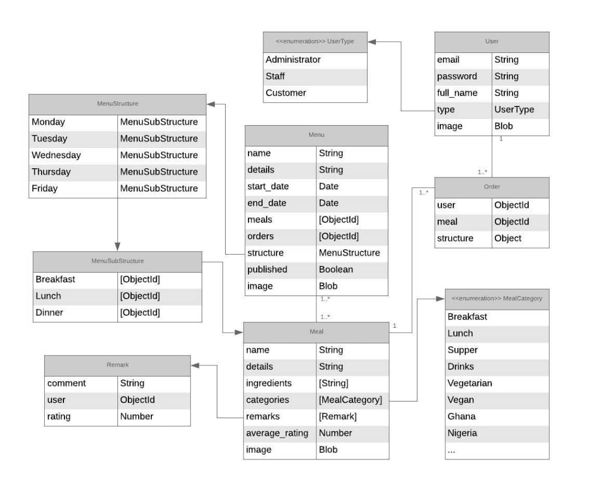

# Kitchen App Challenge

## OVERVIEW
Welcome to the Kitchen App Challenge! The cohort has been split into 10 teams and one team will take home the prize. Your app will also go towards enhancing your own experience at MEST when it is deployed. This will serve as your major assignment for tech class until Capstone 1.

## GOALS
This project would help the kitchen:
1. Reduce wastage
2. Plan weekly purchases effectively
3. Track inventory
4. Measure the satisfaction level of customers, and;
5. Know the potential headcount per meal

## REQUIREMENTS & USER STORIES
The app should be built with Meteor. You may use any frontend framework, but to keep things simple, stick with MongoDB as the database.

### User Stories

#### Administrator
1. Administrator can log in.
2. Administrator can create kitchen staff accounts.
3. Administrator can create other admin accounts.
4. Administrator can approve customer accounts requests.
5. Administrator can publish menu.

#### Kitchen staff
1. Kitchen staff can create weekly menu.
2. Kitchen staff can upload images of menu items.

#### Customer
1. Customer can request an account.
2. Customer can log in.
3. Customer can rate meals, mandatorily.
4. Customer can place weekly meal orders as soon as menu is published. Orders can only be placed after rating previous meals, up until Thursday at noon.
5. Customer can make changes to their meal orders up until Thursday at noon. After this time, they can only view their orders.

#### System
1. System can send notifications to users.

## Database structure

